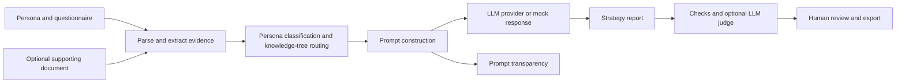

# AISCE ? AI-Driven Strategic Communications Assistant

AISCE helps researchers, university spin-outs and science-led SMEs turn organisational information into a draft communication and engagement plan. It combines a structured questionnaire, optional supporting documents, reusable prompts and a review dashboard in a Streamlit application.

**Status:** MSc research prototype. Generated strategies require human review before use.

[Open the application](https://strategic-comms-assistant.onrender.com) ? [Run locally](#run-locally) ? [Design and evaluation](docs/README.md) ? [Deployment](DEPLOYMENT.md)

## Project at a glance

| | Description |
|---|---|
| Author | Janhvi Tambavekar |
| Programme | MSc Artificial Intelligence, Manchester Metropolitan University |
| Project partner | Scientia Scripta |
| Intended users | Research teams, university spin-outs and innovative SMEs |
| Purpose | Support audience selection, messaging, channel planning and engagement measurement |
| Stack | Python, Streamlit, provider-independent LLM connectors |
| Deliverable | A strategy draft, evaluation diagnostics and Word/PDF downloads |

The project has two connected parts: developing a repeatable prompt-based strategy method, and implementing that method in an application. Evaluation separates generated-strategy quality from interface usability. This repository contains the software and its methodology; client documents, research datasets, survey responses and dissertation files are kept separately.

## How it works

1. **Choose a persona:** research project team, university spin-out or SME innovator.
2. **Provide context:** complete the questionnaire or upload answers, review the extracted fields, and optionally add a brief or further information.
3. **Generate a draft:** persona routing selects a prompt pathway and combines the questionnaire with supporting evidence.
4. **Review the result:** inspect the strategy, timeline/KPI checks, rubric assessment, assembled prompt and token/cost information.
5. **Export and refine:** download a Word or PDF report and review its claims, assumptions and recommendations before sharing it.

The main prompt requests ten numbered sections: executive summary, assumptions, stakeholders, audience journey, messages, channels, engagement timeline, KPIs, risks and next steps. Objectives and outcome measures are an additional unnumbered component. See the [prompt contract](docs/AISCE_prompt_template.md).

## Generation and evaluation

| Mode | Behaviour |
|---|---|
| Mock | Runs without an API key and returns a labelled canned demonstration. It does not produce tailored model output. |
| Quick, in the free-model panel | Uses a shorter generation budget and local deterministic evaluation. |
| Detailed, in the free-model panel | Uses a larger generation budget and a separately selectable LLM judge. |
| Direct provider configuration | Gemini, Anthropic and OpenAI-compatible connectors support provider-specific settings. |

The model pool depends on configured credentials and identifiers in [the example configuration](.env.example) and [the LLM client](src/llm_client.py). Model identifiers, quotas and availability must be checked with the chosen provider; inclusion in the code does not guarantee access. Provider failover and mock fallback must be distinguished from a selected-model result.

Evaluation combines a ten-criterion rubric with checks for report structure, timeline coverage and measurable KPIs. These are diagnostics, not proof that a strategy is accurate or effective. The [evaluation rubric](docs/evaluation_rubric.md) explains the criteria and gates; the [comparison protocol](docs/model_comparison.md) describes controlled experiments.

## Run locally

Use Python 3.11 and create a virtual environment. These commands are for PowerShell:

```powershell
git clone https://github.com/JanhviTambavekar/strategic-comms-assistant.git
cd strategic-comms-assistant
python -m venv .venv
.\.venv\Scripts\Activate.ps1
python -m pip install -r requirements.txt
Copy-Item .env.example .env
python -m streamlit run app.py
```

On macOS/Linux, activate with `source .venv/bin/activate` and copy the configuration with `cp .env.example .env`.

Open `http://localhost:8501`. The example configuration defaults to `LLM_PROVIDER=mock`, so no API account or private dataset is needed to explore the workflow. Enter fictional information into the form for a demonstration.

For live generation, edit your local `.env`: select a provider, add its key and configure an available model. For the shared model panel, use `LLM_PROVIDER=free` and configure at least one supported provider. Restart after configuration changes. The local `.env` overrides existing environment values.

Never commit a populated `.env` or Streamlit secrets file. Hosted credentials are configured outside Git; see [deployment instructions](DEPLOYMENT.md).

## Architecture



| Location | Responsibility |
|---|---|
| [`app.py`](app.py) | Streamlit interface and workflow orchestration |
| [`config/`](config/) | Persona labels and questionnaire schemas; no completed responses |
| [`prompts/`](prompts/) | Reusable strategy and evaluation instructions |
| [`src/`](src/) | Parsing, routing, model access, evaluation, formatting and export |
| [`tests/`](tests/) | Unit tests with small in-code synthetic fixtures |
| [`docs/`](docs/README.md) | Design rationale, evaluation methods and technical notes |
| [`render.yaml`](render.yaml) | Render deployment blueprint |
| [`.env.example`](.env.example) | Configuration names and empty credential placeholders |

## Tests

```powershell
python -m unittest discover -s tests -q
```

The suite runs without live provider calls. It covers timeline and KPI validation, evaluation gates, response handling, model-pool configuration and report-title formatting. Passing tests establish these behaviours, not the effectiveness of a real communication campaign.

## Repository and data boundaries

Keep source code, reusable prompts, questionnaire schemas, tests and documentation in Git. Keep completed questionnaires, uploaded briefs, survey results, generated strategies, experiment outputs and dissertation/approval documents outside the repository or in ignored local directories.

- Credentials, local data, uploads, outputs and common report/archive formats are ignored.
- The app processes uploads for the active session; live generation sends assembled evidence to the configured provider. This is not a secure client-record system.
- Do not enter confidential or personal material into a public demonstration.
- Formerly tracked example inputs and outputs were removed from the current tree; Git history can still contain earlier versions.

Read [contribution guidance](CONTRIBUTING.md) before committing changes.

## Scope and limitations

AISCE demonstrates a complete research workflow but needs broader user evaluation and production controls for confidential use. Synthetic demonstrations do not show real organisational impact. Automated scores can miss contextual mistakes, and template-sensitive checks can misclassify differently formatted content. Review factual claims, audiences, budgets, timelines and permissions before using a strategy.

Authentication, persistent audit storage, retention controls, stronger upload validation and more extensive live-provider testing are further development priorities. Historical notes are identified in the [documentation index](docs/README.md); the code and current setup guides define the runnable application.
